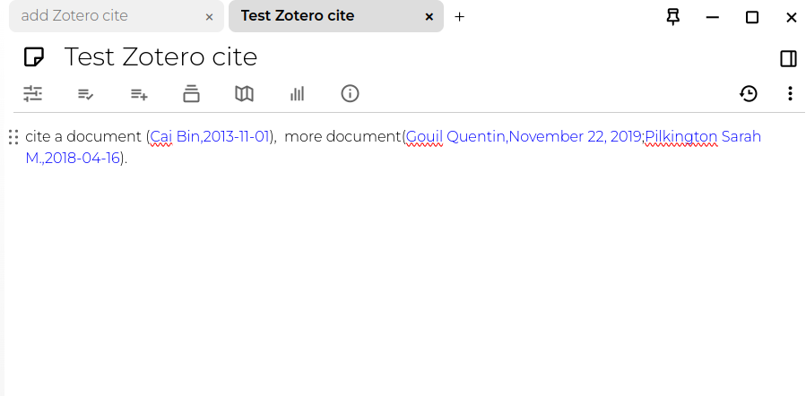

# Trillium Zotero

[English](README.md) | [中文](README.zh.md)

让在 Trillium 中引用 Zotero 文档成为可能！



**欢迎提交拉取请求或 Fork 后重新创建**

## 使用方法

**插入引用**

    - 确保 Zotero 正在运行
    - 在 Trilium 笔记将光标移到需要插入参考的位置，点击右下角 📚 按钮
    - Zotero 会弹出选择窗口，勾选你要引用的文献
    - 返回 Trilium，引用已自动插入为 (Smith, 2020; Zhang, 2022)

> 注意：老版本中"Alt+Shift+X"中快捷键仍然保留，可在代码中对应位置修改

**参考文献列表**
    若笔记中存在二级标题：`## References` 或 `## Ref` ，每次插入文献会自动更新参考文献列表。也可将鼠标悬停在 📚 按钮上，届时会出现 “R” 按钮，点击即可手动刷新

    ⚠️ 自动生成的内容包含保护提示，请勿手动修改，否则下次更新会被覆盖。


## 安装

**此插件依赖于 Zotero 的 Better BibTeX。请参考 [此链接](https://retorque.re/zotero-better-bibtex/installation/index.html) 获取安装说明。**

1. 打开 Trillium 并导航到您想要创建笔记的部分。
2. 点击“新建笔记”按钮或使用键盘快捷键创建新笔记。
3. 在笔记编辑器中，将笔记类型设置为 "JS frontend"，如果您希望它在启动时启用，请添加标签 `#run=frontendStartup`。
4. 复制 `AddZoteroCitation.js` 的内容并粘贴到笔记的内容区域。
6. 重启 Trillium 以确保更改生效。


## 导出

**导出依赖于 trilium-py，请参考 [此链接](https://github.com/Nriver/trilium-py#-installation) 获取安装说明。**

请编辑 `config.ini` 文件来设置参数。

此脚本将 Trilium 笔记的内容转换为 Markdown，使用 Better BibTeX for Zotero 提供的 `zotero.lua` 进行 Zotero 引用处理，最后导出为 docx 格式。

``` bash
python export.py trilium_id
```

## 已知问题

- 打开笔记后，您可能需要等待大约 3 秒钟让 JS 插件加载。
~~ 缺乏更友好的用户界面（已在2025.11.21版本添加）。~~
~~ 缺乏导出功能（已在2023.11.30版本添加，liuxiawei）。~~
- 缺乏对特殊内容的测试。

## 待办事项
~~ 使其更用户友好~~

## 致谢
感谢 @yiranlus 对代码更新和新功能添加

## 更新日志

- 2025.11.21 添加了UI，合并 @yiranlus 代码
- 2025.04.25 添加了参考文献列表生成支持
- 2023.11.22 初始化项目
- 2023.11.30 添加导出功能
